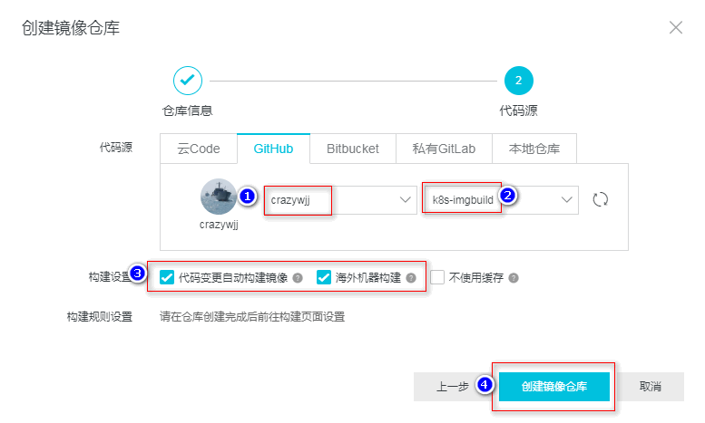
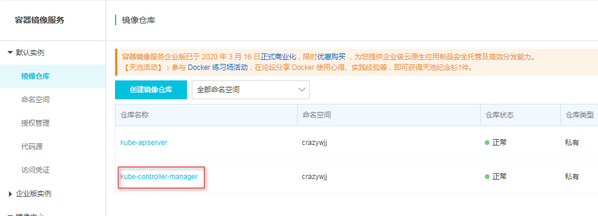
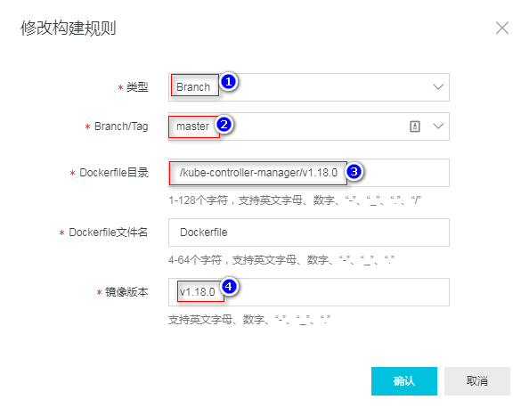
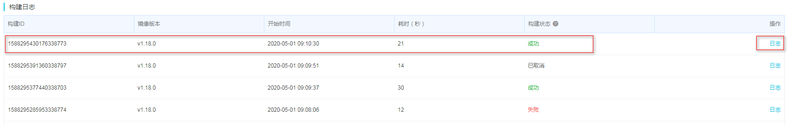
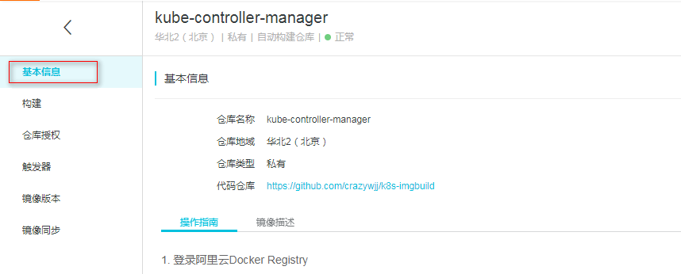

# k8s-imgbuild

# 使用我构建好的

| 名称           | 版本    | 下载地址                                                     |
| -------------- | ------- | ------------------------------------------------------------ |
| kube-apiserver | v1.18.0 | sudo docker pull registry.cn-beijing.aliyuncs.com/crazywjj/kube-apiserver:v1.18.0 |
|                |         |                                                              |
|                |         |                                                              |
|                |         |                                                              |
|                |         |                                                              |
|                |         |                                                              |


# 如何自己构建

通过kubeadm部署k8s集群，在执行kubeadm init命令时，默认生成的manifests文件夹下yaml文件的镜像都是gcr.io上的，在国内由于被墙而不能正常下载，也就导致了集群不能正常安装。

**解决办法：** 购买vpn 或者通过阿里云的容器镜像服务镜像构建。

## Step 1：创建github仓库

首先在github创建一个repository，创建好后然后git clone到本地，并在本地创建所需下载的镜像dockerfile，这里本地的目录层级为 镜像名称->版本号->dockerfile。创建之后再把所有的文件push到github仓库。最后的结果如下：


Dockerfile内容如下：

```bash
From k8s.gcr.io/kube-scheduler:v1.18.0
MAINTAINER Rotel <602616568@qq.com>
```


## Step 2：构建镜像

登录阿里云的容器镜像服务网址  https://www.aliyun.com/product/acr ，进入管理控制台，在容器镜像服务->镜像列表->创建镜像仓库，按照要求填写相关信息，示例如下

**进入阿里云容器镜像服务控制台：**


**创建自己的命名空间：**


**创建镜像仓库：**





**添加构建规则：**







**立即构建：**


构建日志：失败请查看日志




## Step 3：拉取镜像




**服务器拉取**

1、登录阿里云Docker Registry

```bash
[root@ k8s-m01 ~]#  sudo docker login --username=xxx@qq.com registry.cn-beijing.aliyuncs.com
Password:阿里云开通服务时密码
```

用于登录的用户名为阿里云账号全名，密码为开通服务时设置的密码。

您可以在访问凭证页面修改凭证密码。

2.、从Registry中拉取镜像

```bash
[root@ k8s-m01 ~]# sudo docker pull registry.cn-beijing.aliyuncs.com/crazywjj/kube-controller-manager:v1.18.0
v1.18.0: Pulling from crazywjj/kube-controller-manager
597de8ba0c30: Already exists
6d779a49f26c: Pull complete
Digest: sha256:41d670e8a18ed7c7f7bb4bdb8e43f73be11c11a2e25f1d60e10ef5f109daa22f
Status: Downloaded newer image for registry.cn-beijing.aliyuncs.com/crazywjj/kube-controller-manager:v1.18.0

```

3、 重命名镜像 

```bash
[root@ k8s-m01 ~]# docker images
REPOSITORY                                                          TAG                 IMAGE ID            CREATED             SIZE
registry.cn-beijing.aliyuncs.com/crazywjj/kube-controller-manager   v1.18.0             30debe67b819        42 minutes ago      162MB
k8s.gcr.io/kube-apiserver                                           v1.18.0             1746857eef21        About an hour ago   173MB


[root@ k8s-m01 ~]# docker tag registry.cn-beijing.aliyuncs.com/crazywjj/kube-controller-manager:v1.18.0 k8s.gcr.io/kube-controller-manager:v1.18.0

[root@ k8s-m01 ~]# docker rmi -f registry.cn-beijing.aliyuncs.com/crazywjj/kube-controller-manager:v1.18.0
Untagged: registry.cn-beijing.aliyuncs.com/crazywjj/kube-controller-manager:v1.18.0
Untagged: registry.cn-beijing.aliyuncs.com/crazywjj/kube-controller-manager@sha256:41d670e8a18ed7c7f7bb4bdb8e43f73be11c11a2e25f1d60e10ef5f109daa22f

[root@ k8s-m01 ~]# docker images
REPOSITORY                           TAG                 IMAGE ID            CREATED             SIZE
k8s.gcr.io/kube-controller-manager   v1.18.0             30debe67b819        44 minutes ago      162MB
k8s.gcr.io/kube-apiserver            v1.18.0             1746857eef21        About an hour ago   173MB

```


