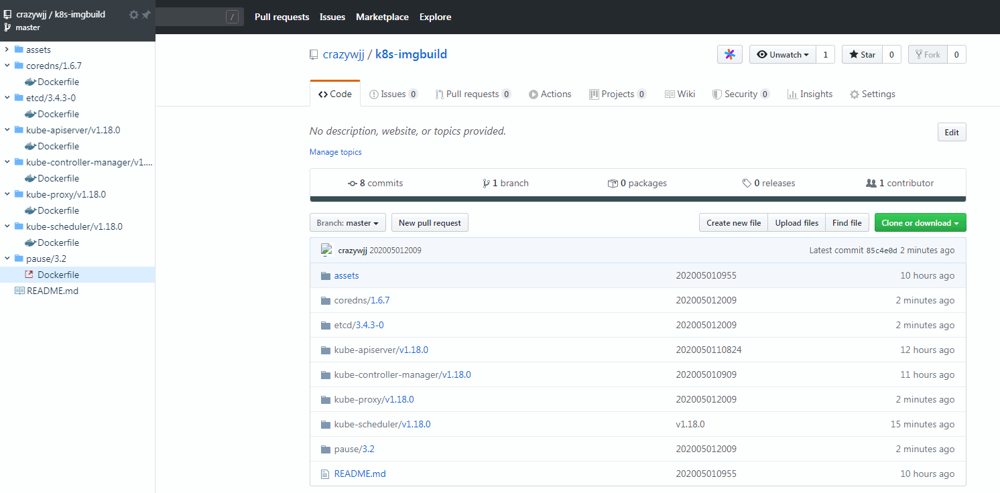
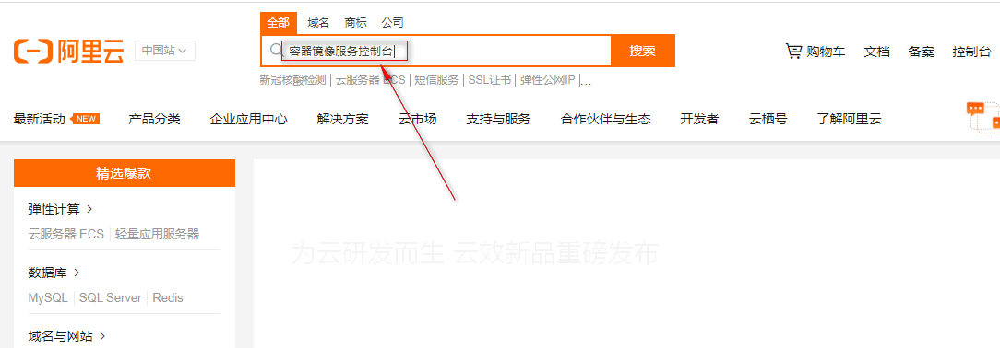
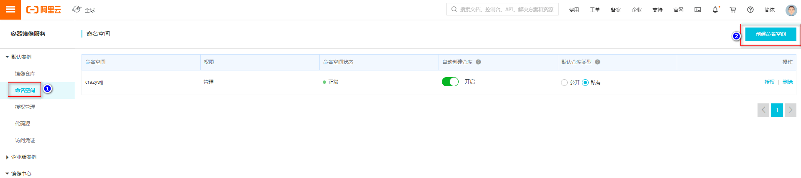
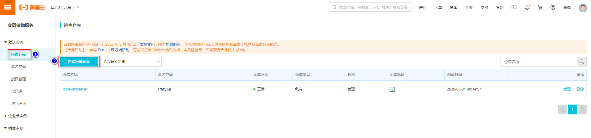
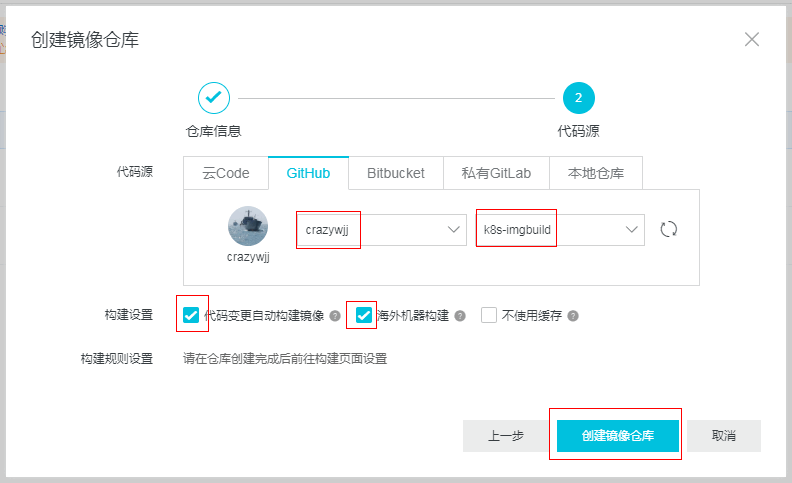
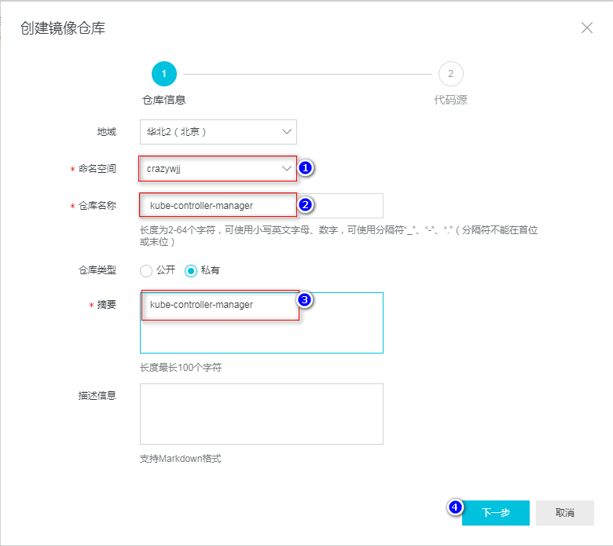
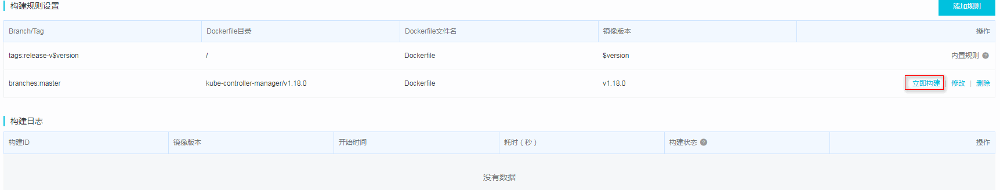
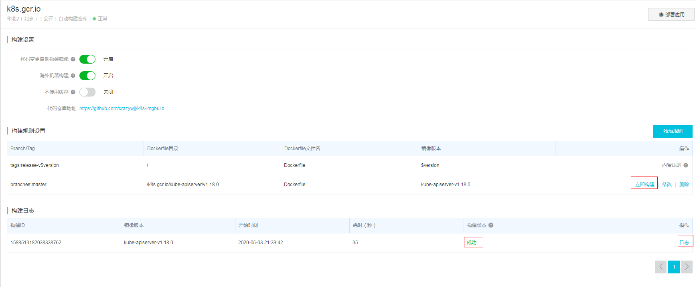
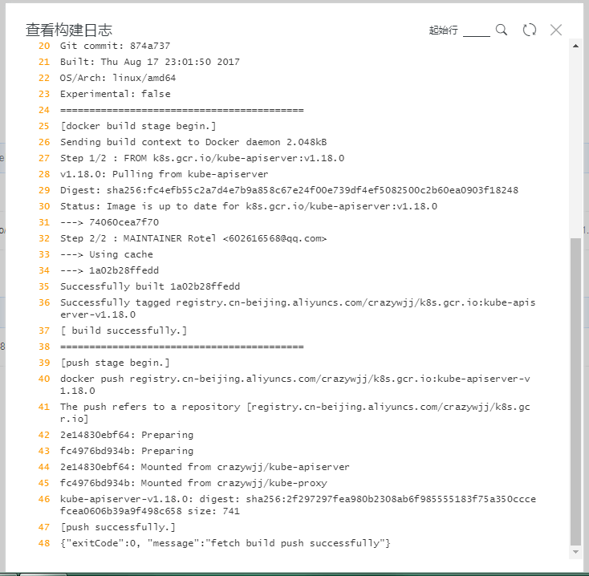

# k8s-imgbuild

# 构建信息

**阿里云容器镜像仓库信息：**

| 仓库名称                | Dockerfile目录                   | 镜像版本 | 拉取镜像                                                     |
| ----------------------- | -------------------------------- | :------- | ------------------------------------------------------------ |
| kube-apiserver          | /kube-apiserver/v1.18.0          | v1.18.0  | sudo docker pull registry.cn-beijing.aliyuncs.com/crazywjj/kube-apiserver:[镜像版本号] |
| kube-controller-manager | /kube-controller-manager/v1.18.0 | v1.18.0  | sudo docker pull registry.cn-beijing.aliyuncs.com/crazywjj/kube-controller-manager:[镜像版本号] |
| kube-proxy              | /kube-proxy/v1.18.0              | v1.18.0  | sudo docker pull registry.cn-beijing.aliyuncs.com/crazywjj/kube-proxy:[镜像版本号] |
| kube-scheduler          | /kube-scheduler/v1.18.0          | v1.18.0  | sudo docker pull registry.cn-beijing.aliyuncs.com/crazywjj/kube-scheduler:[镜像版本号] |
| coredns                 | /coredns/1.6.7                   | 1.6.7    | sudo docker pull registry.cn-beijing.aliyuncs.com/crazywjj/coredns:[镜像版本号] |
| etcd                    | /etcd/3.4.3-0                    | 3.4.3-0  | sudo docker pull registry.cn-beijing.aliyuncs.com/crazywjj/etcd:[镜像版本号] |
| pause                   | /pause/3.2                       | 3.2      | sudo docker pull registry.cn-beijing.aliyuncs.com/crazywjj/pause:[镜像版本号] |


| 仓库名称 | Dockerfile目录                     | 镜像版本                   | 拉取镜像                                                     |
| -------- | ---------------------------------- | -------------------------- | ------------------------------------------------------------ |
| calico   | /calico/cni/v3.13.3                | cni_v3.13.3                | sudo docker pull registry.cn-beijing.aliyuncs.com/crazywjj/calico:[镜像版本号] |
|          | /calico/kube-controllers/v3.13.3   | kube-controllers_v3.13.3   | sudo docker pull registry.cn-beijing.aliyuncs.com/crazywjj/calico:[镜像版本号] |
|          | /calico/node/v3.13.3               | node_v3.13.3               | sudo docker pull registry.cn-beijing.aliyuncs.com/crazywjj/calico:[镜像版本号] |
|          | /calico/pod2daemon-flexvol/v3.13.3 | pod2daemon-flexvol_v3.13.3 | sudo docker pull registry.cn-beijing.aliyuncs.com/crazywjj/calico:[镜像版本号] |


| 仓库名称 | Dockerfile目录           | 镜像版本        | 拉取镜像                                                     |
| -------- | ------------------------ | --------------- | ------------------------------------------------------------ |
| flannel  | /flannel/v0.12.0-amd64   | v0.12.0-amd64   | sudo docker pull registry.cn-beijing.aliyuncs.com/crazywjj/flannel:[镜像版本号] |
|          | /flannel/v0.12.0-arm     | v0.12.0-arm     | sudo docker pull registry.cn-beijing.aliyuncs.com/crazywjj/flannel:[镜像版本号] |
|          | /flannel/v0.12.0-arm64   | v0.12.0-arm64   | sudo docker pull registry.cn-beijing.aliyuncs.com/crazywjj/flannel:[镜像版本号] |
|          | /flannel/v0.12.0-ppc64le | v0.12.0-ppc64le | sudo docker pull registry.cn-beijing.aliyuncs.com/crazywjj/flannel:[镜像版本号] |
|          | /flannel/v0.12.0-s390x   | v0.12.0-s390x   | sudo docker pull registry.cn-beijing.aliyuncs.com/crazywjj/flannel:[镜像版本号] |


| 仓库名称     | Dockerfile目录                       | 镜像版本   | 拉取镜像                                                     |
| ------------ | ------------------------------------ | ---------- | ------------------------------------------------------------ |
| kubernetesui | /kubernetesui/dashboard/v2.0.0-rc7   | v2.0.0-rc7 | sudo docker pull registry.cn-beijing.aliyuncs.com/crazywjj/kubernetesui:[镜像版本号] |
|              | /kubernetesui/metrics-scraper/v1.0.4 | v1.0.4     | sudo docker pull registry.cn-beijing.aliyuncs.com/crazywjj/kubernetesui:[镜像版本号] |


| 仓库名称         | Dockerfile目录                                              | 镜像版本                            | 拉取镜像                                                     |
| ---------------- | ----------------------------------------------------------- | ----------------------------------- | ------------------------------------------------------------ |
| grafana          | /kube-prometheus/grafana/6.6.0                              | 6.6.0                               | sudo docker pull registry.cn-beijing.aliyuncs.com/crazywjj/grafana:[镜像版本号] |
| configmap-reload | /kube-prometheus/configmap-reload/v0.3.0                    | v0.3.0                              | sudo docker pull registry.cn-beijing.aliyuncs.com/crazywjj/configmap-reload:[镜像版本号] |
| prometheus       | /kube-prometheus/prometheus/alertmanager/v0.20.0            | alertmanager_v0.20.0                | sudo docker pull registry.cn-beijing.aliyuncs.com/crazywjj/prometheus:[镜像版本号] |
|                  | /kube-prometheus/prometheus/node-exporter/v0.18.1           | node-exporter_v0.18.1               | sudo docker pull registry.cn-beijing.aliyuncs.com/crazywjj/prometheus:[镜像版本号] |
|                  | /kube-prometheus/prometheus/prometheus/v2.17.2              | prometheus_v2.17.2                  | sudo docker pull registry.cn-beijing.aliyuncs.com/crazywjj/prometheus:[镜像版本号] |
| coreos           | /kube-prometheus/coreos/k8s-prometheus-adapter-amd64/v0.5.0 | k8s-prometheus-adapter-amd64_v0.5.0 | sudo docker pull registry.cn-beijing.aliyuncs.com/crazywjj/coreos:[镜像版本号] |
|                  | /kube-prometheus/coreos/kube-rbac-proxy/v0.4.1              | kube-rbac-proxy_v0.4.1              | sudo docker pull registry.cn-beijing.aliyuncs.com/crazywjj/coreos:[镜像版本号] |
|                  | /kube-prometheus/coreos/kube-state-metrics/v1.9.5           | kube-state-metrics_v1.9.5           | sudo docker pull registry.cn-beijing.aliyuncs.com/crazywjj/coreos:[镜像版本号] |
|                  | /kube-prometheus/coreos/prometheus-config-reloader/v0.38.1  | prometheus-config-reloader_v0.38.1  | sudo docker pull registry.cn-beijing.aliyuncs.com/crazywjj/coreos:[镜像版本号] |
|                  | /kube-prometheus/coreos/prometheus-operator/v0.38.1         | prometheus-operator_v0.38.1         | sudo docker pull registry.cn-beijing.aliyuncs.com/crazywjj/coreos:[镜像版本号] |


**下载所有镜像并改名：**

```bash
----------------------------------------kubeadm镜像-------------------------------------
cat >k8s.ini<<EOF
kube-apiserver:v1.18.0
kube-controller-manager:v1.18.0
kube-proxy:v1.18.0
kube-scheduler:v1.18.0
coredns:1.6.7
etcd:3.4.3-0
pause:3.2
EOF

for i in `cat k8s.ini`
do
	REPO=$(echo "$i"|awk -F ':' '{print $1}')
	TAG=$(echo "$i"|awk -F ':' '{print $2}')
    sudo docker pull registry.cn-beijing.aliyuncs.com/crazywjj/$i
	sudo docker tag  registry.cn-beijing.aliyuncs.com/crazywjj/$i k8s.gcr.io/$REPO:$TAG
	sudo docker rmi -f registry.cn-beijing.aliyuncs.com/crazywjj/$i
done

----------------------------------------calico镜像-------------------------------------
cat >calico.ini<<EOF
cni_v3.13.3
node_v3.13.3
kube-controllers_v3.13.3
pod2daemon-flexvol_v3.13.3
EOF

for i in `cat calico.ini`
do
	REPO=$(echo "$i"|awk -F '_' '{print $1}')
	TAG=$(echo "$i"|awk -F '_' '{print $NF}')
    sudo docker pull registry.cn-beijing.aliyuncs.com/crazywjj/calico:$i
	sudo docker tag  registry.cn-beijing.aliyuncs.com/crazywjj/calico:$i calico/$REPO:$TAG
	sudo docker rmi -f registry.cn-beijing.aliyuncs.com/crazywjj/calico:$i
done

----------------------------------------flannel镜像-------------------------------------
cat >flannel.ini<<EOF
v0.12.0-amd64
v0.12.0-arm
v0.12.0-arm64
v0.12.0-ppc64le
v0.12.0-s390x
EOF

for i in `cat flannel.ini`
do
    sudo docker pull registry.cn-beijing.aliyuncs.com/crazywjj/flannel:$i
	sudo docker tag  registry.cn-beijing.aliyuncs.com/crazywjj/flannel:$i quay.io/coreos/flannel:$i
	sudo docker rmi -f registry.cn-beijing.aliyuncs.com/crazywjj/flannel:$i
done

----------------------------------------dasboard镜像-------------------------------------
cat >kubernetesui.ini<<EOF
dashboard:v2.0.0-rc7
metrics-scraper:v1.0.4
EOF

for i in `cat kubernetesui.ini`
do
	REPO=$(echo "$i"|awk -F ':' '{print $1}')
	TAG=$(echo "$i"|awk -F ':' '{print $NF}')
    sudo docker pull registry.cn-beijing.aliyuncs.com/crazywjj/kubernetesui:$TAG
	sudo docker tag  registry.cn-beijing.aliyuncs.com/crazywjj/kubernetesui:$TAG kubernetesui/$i
	sudo docker rmi -f registry.cn-beijing.aliyuncs.com/crazywjj/kubernetesui:$TAG
done

----------------------------------------grafana镜像-------------------------------------
TAG='6.6.0'
sudo docker pull registry.cn-beijing.aliyuncs.com/crazywjj/grafana:$TAG
sudo docker tag  registry.cn-beijing.aliyuncs.com/crazywjj/grafana:$TAG grafana/grafana:$TAG
sudo docker rmi -f registry.cn-beijing.aliyuncs.com/crazywjj/grafana:$TAG

----------------------------------------configmap-reload镜像------------------------------------TAG='v0.3.0'
sudo docker pull registry.cn-beijing.aliyuncs.com/crazywjj/configmap-reload:$TAG
sudo docker tag  registry.cn-beijing.aliyuncs.com/crazywjj/configmap-reload:$TAG jimmidyson/configmap-reload:$TAG
sudo docker rmi -f registry.cn-beijing.aliyuncs.com/crazywjj/configmap-reload:$TAG

----------------------------------------prometheus镜像------------------------------------
cat >prometheus.ini<<EOF
alertmanager_v0.20.0
node-exporter_v0.18.1	
prometheus_v2.17.2
EOF

for i in `cat prometheus.ini`
do
	REPO=$(echo "$i"|awk -F '_' '{print $1}')
	TAG=$(echo "$i"|awk -F '_' '{print $NF}')
	sudo docker pull registry.cn-beijing.aliyuncs.com/crazywjj/prometheus:$i
	sudo docker tag  registry.cn-beijing.aliyuncs.com/crazywjj/prometheus:$i quay.io/prometheus/$REPO:$TAG
	sudo docker rmi -f registry.cn-beijing.aliyuncs.com/crazywjj/prometheus:$i
done

----------------------------------------coreos镜像------------------------------------
cat >coreos.ini<<EOF
k8s-prometheus-adapter-amd64_v0.5.0
kube-rbac-proxy_v0.4.1
kube-state-metrics_v1.9.5
prometheus-config-reloader_v0.38.1
prometheus-operator_v0.38.1
EOF

for i in `cat coreos.ini`
do
	REPO=$(echo "$i"|awk -F '_' '{print $1}')
	TAG=$(echo "$i"|awk -F '_' '{print $NF}')
    sudo docker pull registry.cn-beijing.aliyuncs.com/crazywjj/coreos:$i
	sudo docker tag  registry.cn-beijing.aliyuncs.com/crazywjj/coreos:$i quay.io/coreos/$REPO:$TAG
	sudo docker rmi -f registry.cn-beijing.aliyuncs.com/crazywjj/coreos:$i
done
```


# 如何构建

通过kubeadm部署k8s集群，在执行kubeadm init命令时，默认生成的manifests文件夹下yaml文件的镜像都是gcr.io上的，在国内由于被墙而不能正常下载，也就导致了集群不能正常安装。

**解决办法：** 购买vpn 或者通过阿里云的容器镜像服务镜像构建。

## Step 1：创建github仓库

首先在github创建一个repository，创建好后然后git clone到本地，并在本地创建所需下载的镜像dockerfile，这里本地的目录层级为 镜像名称->版本号->dockerfile。创建之后再把所有的文件push到github仓库。最后的结果如下：




Dockerfile内容如下：

```bash
From k8s.gcr.io/kube-scheduler:v1.18.0
MAINTAINER Rotel <602616568@qq.com>
```


## Step 2：构建镜像

登录阿里云的容器镜像服务网址  https://www.aliyun.com/product/acr ，进入管理控制台，在容器镜像服务->镜像列表->创建镜像仓库，按照要求填写相关信息，示例如下

**进入阿里云容器镜像服务控制台：**



**创建自己的命名空间：**




**创建镜像仓库：**









**添加构建规则：**

**==注意：每个仓库最多能创建5条规则==**



**立即构建：**



构建日志：失败请查看日志




## Step 3：拉取镜像

**服务器拉取**

1、登录阿里云Docker Registry（私有库需要登录；公有库直接拉取）

```bash
$ sudo docker login --username=xxx@qq.com registry.cn-beijing.aliyuncs.com
Password:阿里云开通服务时密码
```

用于登录的用户名为阿里云账号全名，密码为开通服务时设置的密码。

您可以在访问凭证页面修改凭证密码。

2.、从Registry中拉取镜像

```bash
$ sudo docker pull registry.cn-beijing.aliyuncs.com/crazywjj/kube-apiserver:v1.18.0
```

3、 重命名镜像 

```bash
$ docker images
REPOSITORY                                             TAG                      IMAGE ID            CREATED             SIZE
registry.cn-beijing.aliyuncs.com/crazywjj/kube-apiserver   v1.18.0   1a02b28ffedd        About an hour ago   173MB

$ docker tag registry.cn-beijing.aliyuncs.com/crazywjj/kube-apiserver:v1.18.0 k8s.gcr.io/kube-controller-manager:v1.18.0

$ docker rmi -f registry.cn-beijing.aliyuncs.com/crazywjj/kube-apiserver:v1.18.0 
```


